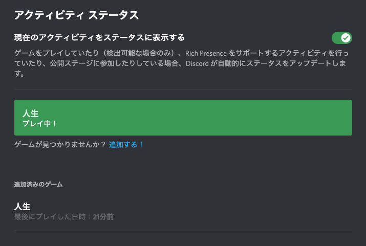

# 人生

Discordの画面に `人生をプレイ中` と表示する「だけ」のために作られたMacアプリです。

## インストール方法
[リリースのページ](https://github.com/motooka/jinsei/releases) から最新の `jinsei.app.zip` ファイルをダウンロードして、出てきたアプリを `/Applications` にコピーしてご利用下さい。

## 動作環境
macOS Mojave (10.14) 以上

## 使用方法
- インストールしたアプリを起動
- Discordの設定の `アクティビティ ステータス` を開く

- ここで「人生」を追加したり選択したりする

※このようなアプリを使わなくても、同様のことはDiscordの設定で実現可能です。参考記事は[こちら](https://dorokin.com/discord_edit_playingame)

## ライセンス
MITライセンス。詳細は[LICENSE.md](./LICENSE.md) 参照。

## プライバシー
このアプリは、ユーザの情報を収集することはありません。ネットワークに接続することもありませんし、ファイルを読み取ることもありません。

## 開発環境
- macOS Big Sur 11.6
- Xcode 12.5.1

## 開発環境とビルド方法
外部のライブラリ等は何も使っていないので、何も考えずに `jinsei.xcodeproj` を開いてビルドすれば良いです。

作者以外がビルドする際は、コード署名のチームの設定だけ自身のものに変更する必要があるでしょう。
